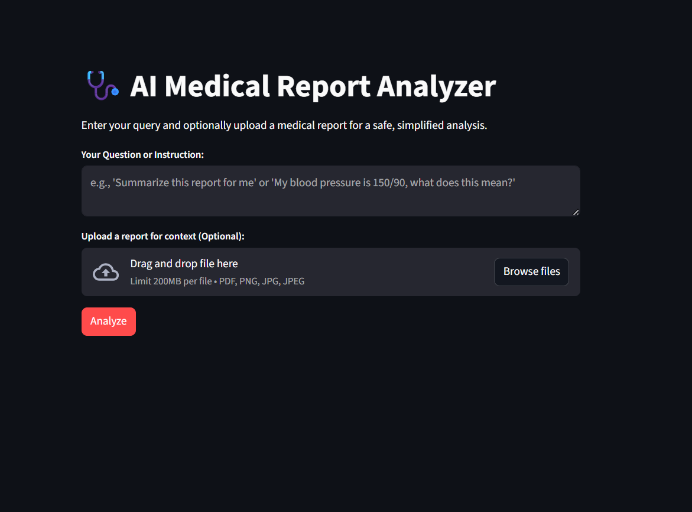

# 🩺 AI Medical Report Analyzer

This project is a Streamlit web application that acts as a safe, AI-powered medical assistant. It uses the Google Gemini API (`gemini-2.5-flash`) to analyze user questions or uploaded medical reports (PDFs, images).

The app provides simplified, easy-to-understand explanations for patients. It has a strong emphasis on safety, using advanced prompt engineering to *never* provide a direct diagnosis or medical advice, and to always defer to a qualified doctor.


*(**Note:** Replace `screenshot.png` with an actual screenshot of your running application.)*

---

## Features

* **Simple Text Queries:** Ask medical-related questions (e.g., "My blood pressure is 150/90, what does this mean?").
* **File Uploads:** Upload PDFs, PNGs, or JPGs of medical reports for a simplified summary.
* **Safety-First Responses:** The AI is given a strict set of rules to prevent it from giving dangerous advice.
* **Educational Guidance:** For relevant topics (like high blood pressure), the AI can suggest general dietary topics (like the DASH diet) for the user to *discuss with their doctor*.
* **Mandatory Disclaimer:** Every response includes a disclaimer to consult a medical professional.

---

## How It Works

The app's intelligence comes from its "system prompt." Before sending a user's question to the AI, it attaches a detailed set of **CRITICAL SAFETY RULES**.

These rules instruct the AI to act as a "highly skilled medical assistant" and explicitly forbid it from:
1.  **Diagnosing** conditions.
2.  Giving **direct advice** or treatment plans.
3.  It *must* **always defer to a doctor**.
4.  It *must* include a **safety disclaimer**.

This "prompt engineering" ensures the AI remains a helpful educational tool, not a dangerous replacement for a doctor.

---

## Setup & Configuration

Follow these steps to run the project locally.

### 1. Prerequisites

* Python 3.9+
* A Google Gemini API Key

### 2. Installation

1.  **Clone the repository:**
    ```bash
    git clone <your-repo-url>
    cd <your-project-folder>
    ```

2.  **Create and activate a virtual environment:**
    ```bash
    # Create the venv
    python -m venv venv

    # Activate on Windows
    venv\Scripts\activate

    # Activate on macOS/Linux
    source venv/bin/activate
    ```

3.  **Install the required packages:**
    (Make sure you have a `requirements.txt` file in your folder.)
    ```bash
    pip install -r requirements.txt
    ```

### 3. Configuration

This app requires a Google Gemini API key to function.

1.  Get your API key from [Google AI Studio](https://aistudio.google.com/).
2.  In your project's root directory, create a new file named `.env`.
3.  Add your API key to the `.env` file like this:

    ```
    GEMINI_API_KEY="YOUR_API_KEY_HERE"
    ```

---

## How to Run

1.  Make sure your virtual environment is activated.
2.  Run the Streamlit app from your terminal:

    ```bash
    streamlit run streamlit_app.py
    ```
    *(Note: If you renamed your file to `app.py`, use `streamlit run app.py`)*

3.  The application will automatically open in your web browser.

---

## Project Files

* `streamlit_app.py`: The main Python script for the Streamlit app.
* `requirements.txt`: A list of all necessary Python packages.
* `.env`: A (private) file that stores your secret API key.
* `README.md`: This file.

### `requirements.txt`